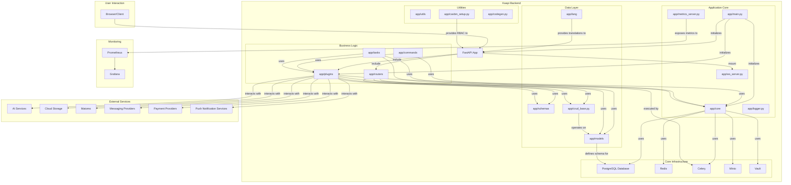

```mermaid
%% Mermaid diagram
graph TD
    subgraph "User Interaction"
        A[Browser/Client]
    end

    subgraph "Kaapi Backend"
        C[FastAPI App]

        subgraph "Core Infrastructure"
            D[PostgreSQL Database]
            E[Redis]
            F[Celery]
            G[Minio]
            H[Vault]
        end

        subgraph "Application Core"
            Core[app/core]
            Main[app/main.py]
            WebSocketServer[app/ws_server.py]
            MetricsServer[app/metrics_server.py]
            Logger[app/logger.py]
        end

        subgraph "Business Logic"
            Routers[app/routers]
            Plugins[app/plugins]
            Commands[app/commands]
            Tasks[app/tasks]
        end

        subgraph "Data Layer"
            Models[app/models]
            Schemas[app/schemas]
            CRUD[app/crud_base.py]
            Lang[app/lang]
        end

        subgraph "Utilities"
            Utils[app/utils]
            Casbin[app/casbin_setup.py]
            Codegen[app/codegen.py]
        end
    end

    subgraph "External Services"
        ES1[AI Services]
        ES2[Cloud Storage]
        ES3[Matomo]
        ES4[Messaging Providers]
        ES5[Payment Providers]
        ES6[Push Notification Services]
    end

    subgraph "Monitoring"
        I[Prometheus]
        J[Grafana]
    end

    %% Connections
    A --> C;
    C -- "include" --> Routers;
    C -- "include" --> Plugins;
    C -- "mount" --> WebSocketServer;

    Main -- "initializes" --> C;
    Main -- "initializes" --> Core;
    Main -- "initializes" --> Plugins;

    Core -- "uses" --> D;
    Core -- "uses" --> E;
    Core -- "uses" --> F;
    Core -- "uses" --> G;
    Core -- "uses" --> H;

    Routers -- "uses" --> Schemas;
    Routers -- "uses" --> CRUD;
    Routers -- "uses" --> Models;

    Plugins -- "uses" --> Schemas;
    Plugins -- "uses" --> CRUD;
    Plugins -- "uses" --> Models;
    Plugins -- "uses" --> Core;
    Plugins -- "interacts with" --> ES1;
    Plugins -- "interacts with" --> ES2;
    Plugins -- "interacts with" --> ES3;
    Plugins -- "interacts with" --> ES4;
    Plugins -- "interacts with" --> ES5;
    Plugins -- "interacts with" --> ES6;

    Commands -- "uses" --> Core;
    Commands -- "uses" --> Plugins;

    Tasks -- "executed by" --> F;
    Tasks -- "uses" --> Core;
    Tasks -- "uses" --> Plugins;

    Models -- "defines schema for" --> D;
    CRUD -- "operates on" --> Models;

    MetricsServer -- "exposes metrics to" --> I;
    I --> J;

    Casbin -- "provides RBAC to" --> C;

    Lang -- "provides translations to" --> C;
```